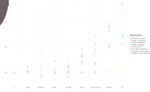

# Julia MicroBenchmarks

These micro-benchmarks, while not comprehensive, do test compiler
performance on a range of common code patterns, such as function
calls, string parsing, sorting, numerical loops, random number
generation, recursion, and array operations.

These micro-benchmark results were obtained on a single core (serial
execution) on [Github
Actions](https://github.com/JuliaLang/Microbenchmarks.jl/actions).
